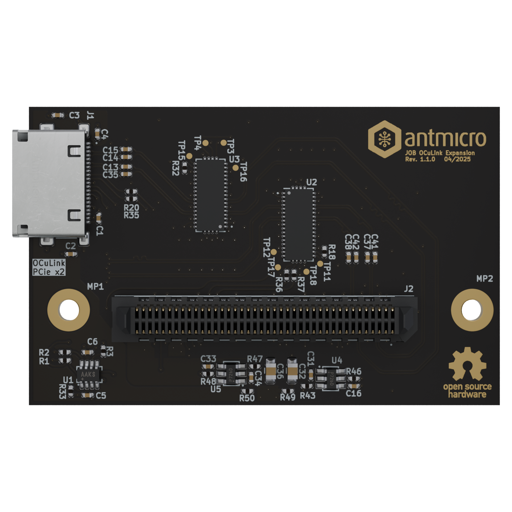

# Jetson Orin Baseboard OCuLink Expansion Board

Copyright (c) 2025 [Antmicro](https://www.antmicro.com)

## Overview

This board is a PCIe to OCuLink adapter that connects to the expansion port on the Jetson Orin Baseboard, allowing PCIe devices to be connected via the OCuLink interface.

## Key features

- Compatible with the [Jetson Orin Baseboard](https://github.com/antmicro/jetson-orin-baseboard)
- Exposes 2 lanes of PCIe via an OCuLink connector
- Provides auxiliary PCIe signals

## Project structure

The main directory contains KiCad PCB project files and README. The remaining files are stored in the following
directories:

-   `img` - contains graphics for this README
-   `doc` - contains schematics in PDF format

## Licensing

This project is published under the [Apache-2.0](LICENSE) license.
