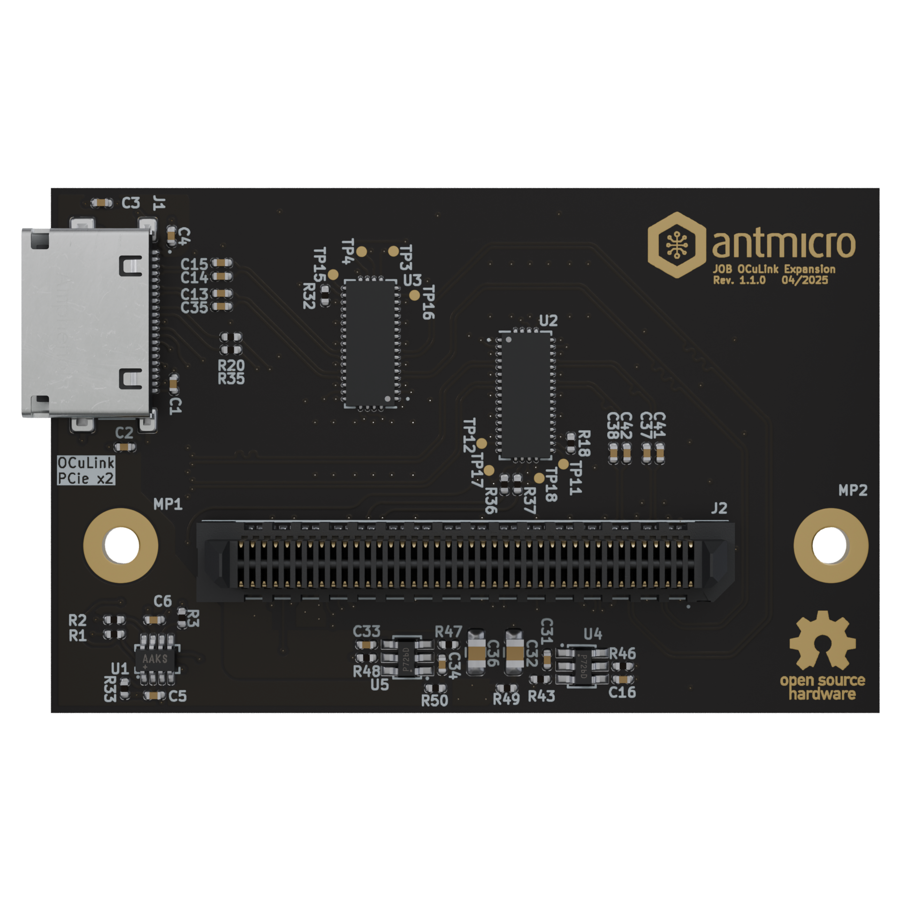

# Jetson Orin Baseboard OCuLink Expansion Board

Copyright (c) 2025 [Antmicro](https://www.antmicro.com)

## Overview

This project includes PCB design files for expansion card compatible with Antmicro's [Jetson Orin Baseboard](https://github.com/antmicro/jetson-orin-baseboard).
This expansion card exposes PCIe x2 break-routed from the Nvidia Jetson Orin Nano/NX SoM, and into an OCuLink-compliant connector.

The PCB design files were created with KiCad 9.x

## Key features

- Compatible with the [Jetson Orin Baseboard](https://github.com/antmicro/jetson-orin-baseboard)
- Exposes 2 lanes of PCIe 4.0 via an OCuLink connector
- Provides auxiliary PCIe signals

## Project structure

The main directory contains KiCad PCB project files and README.
The remaining files are stored in the following directories:

-   `img` - contains graphics for this README

## Licensing

This project is published under the [Apache-2.0](LICENSE) license.
